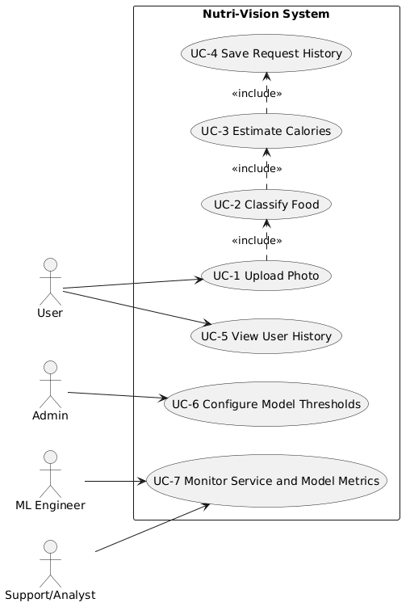
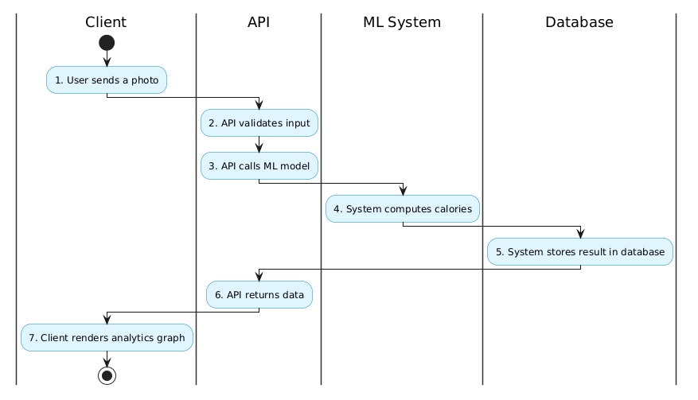

# Software Requirements Specification (SRS)

## Contents
1. [Vision and Context](#1-vision-and-context)
2. [Glossary](#2-glossary)
3. [Actors and Use Case Identification](#3-actors-and-use-case-identification)
4. [Stage 2: System Design and Modeling](#4-stage-2-system-design-and-modeling)
5. [Analysis of Key Use Cases](#5-analysis-of-key-use-cases)
6. [Functional and Non-Functional Requirements](#6-functional-and-non-functional-requirements)
7. [Additional Requirements and Constraints](#7-additional-requirements-and-constraints)
8. [References](#8-references)

---

# 1. Vision and Context

## Product Vision

### Introduction
This document defines the vision, scope, and requirements for Food Vision Analytics, a system that estimates meal calories from photos using computer vision.

### Goal
The goal is to provide a fast and practical nutrition support tool where a user uploads a food photo, receives food class prediction, gets calorie estimation per serving, and can view personal request history.

### Context
The system is developed as part of a data-driven product that combines API services, machine learning inference, and persistent storage for user analytics and progress tracking.

### Summary
Food Vision Analytics is an ML-powered application that:
- accepts meal images from users;
- classifies food type;
- estimates calories per serving;
- stores inference history for each user.

The product is intended for individual users, nutrition-focused apps, and teams building health-related digital services.

## Positioning

### Benefits
- Quick calorie estimation without manual lookup.
- Reduced user effort through photo-based interaction.
- Reusable API for web and mobile products.
- History tracking for user behavior and nutrition insights.

### Problem Statement
Manual calorie counting is slow and inconsistent. Existing approaches often require users to search databases and estimate portions manually, causing friction and low long-term adherence.

## Target Audience

### Primary Users
- End users who want to track calories quickly.
- Product teams integrating nutrition intelligence into their apps.
- Data and ML teams monitoring model quality and system performance.

## Product Capabilities

### 1. Image Upload
Users can upload food photos via API or client application.

### 2. Food Classification
The ML model predicts the food class and confidence score.

### 3. Calorie Estimation
The system estimates calories per serving based on predicted class and nutrition reference data.

### 4. History Management
The system stores and retrieves user request history.

### 5. Monitoring and Quality Control
The platform tracks model performance and response-time metrics.

---

# 2. Glossary

- SRS: Software Requirements Specification.
- Inference: ML model execution on input data.
- Food Class: Predicted category of meal or product.
- Confidence Score: Probability-like score of prediction certainty.
- kcal: Kilocalorie, unit of food energy.
- Serving: Standard portion used for calorie estimation.
- Top-1 Accuracy: Share of predictions where top predicted class is correct.
- Precision/Recall: Class-level quality metrics for prediction performance.
- API: Application Programming Interface.
- p95 Response Time: 95th percentile latency across requests.
- RBAC: Role-Based Access Control.
- PII: Personally Identifiable Information.

---

# 3. Actors and Use Case Identification

## 3.1 Actor Identification

### End Users
- User: uploads food photos, receives calorie estimates, views own history.

### System and Operational Roles
- Admin: manages configuration, thresholds, and operational policies.
- ML Engineer: maintains models, validates quality, and manages versions.
- Support/Analyst: reviews logs and aggregate metrics for reliability.

## 3.2 Actor Registry

| Actor | Description |
|---|---|
| User | Submits meal photos and consumes prediction results. |
| Admin | Operates system settings and access rules. |
| ML Engineer | Monitors model quality and lifecycle. |
| Support/Analyst | Monitors incidents and service-level metrics. |

## 3.3 Use Case List

- UC-1 Upload Photo
- UC-2 Classify Food
- UC-3 Estimate Calories
- UC-4 Save Request History
- UC-5 View User History
- UC-6 Configure Model Thresholds
- UC-7 Monitor Service and Model Metrics

---

# 4. ???????????? Stage 2: System Design and Modeling ?????????????

## 4.1 Use Case Diagram

Status: Placeholder ready

Scope for this diagram:
- Actors: User, Administrator.
- User actions: upload photo, view analytics graph, view personal history.
- Administrator actions: view system statistics, update reference database.

Diagram placeholder:

## 4.2 Activity Diagram / BPMN

Status: Placeholder ready

Business flow to model:
1. User sends a photo.
2. API validates input.
3. API calls ML model.
4. System computes calories.
5. System stores result in database.
6. API returns data.
7. Client renders analytics graph.

Diagram placeholder:

## 4.3 Sequence Diagram

Status: Placeholder ready

Interaction to model:
Client -> Backend API -> ML Model -> Database -> Response.

Diagram placeholder:

IN FUTURE

## 4.4 Functional Requirement Table

| ID | Use Case | Primary Actor | Requirement Description |
|---|---|---|---|
| FR-1 | Upload Photo | User | The system shall accept food image uploads via API/UI. |
| FR-2 | Classify Food | User | The system shall classify uploaded images and return class with confidence. |
| FR-3 | Estimate Calories | User | The system shall estimate calories per serving using class and reference nutrition data. |
| FR-4 | Save Request History | User | The system shall persist request results linked to user identity. |
| FR-5 | View User History | User | The system shall return paginated user history with key result fields. |
| FR-6 | Configure Thresholds | Admin | The system shall allow configurable confidence threshold management. |
| FR-7 | Monitor Metrics | ML Engineer/Support Analyst | The system shall expose model and API performance metrics. |

## 4.5 Component Diagram

Status: Placeholder ready

Scope for this diagram:
- Core components: Client App, API Backend, ML Inference Service, Database, Analytics Module.
- Interfaces between components.
- Data flow direction between components.

Diagram placeholder:

IN FUTURE

## 4.6 Deployment Diagram

Status: Placeholder ready

Scope for this diagram:
- Runtime nodes: User Device, Application Server, Model Runtime, Database Server.
- Deployment artifacts: API service, ML model, persistent storage.
- Network boundaries and communication links.

Diagram placeholder:

IN FUTURE

## 4.7 State Diagram (Request Lifecycle)

Status: Placeholder ready

Scope for this diagram:
- States: Received, Validated, Inference Running, Calories Estimated, Saved, Responded, Failed.
- Transitions caused by validation, inference, database, and response events.

Diagram placeholder:

IN FUTURE

## 4.8 Data Model Diagram (ERD)

Status: Placeholder ready

Scope for this diagram:
- Main entities: User, PredictionRequest, PredictionResult, NutritionReference, ModelVersion.
- Key relations and cardinalities.
- Required identifiers and timestamps.

Diagram placeholder:

IN FUTURE

---

# 5. Analysis of Key Use Cases

## Selection of Key Use Cases
Based on business criticality and architecture impact, the following are key:
- UC-1 Upload Photo
- UC-2 Classify Food
- UC-3 Estimate Calories
- UC-4 Save Request History

## UC-1 Upload Photo

Primary actor: User  
Priority: Critical  
Architecture impact: High

Main flow:
1. User submits an image.
2. System validates format, size, and content type.
3. System stores temporary image artifact and request context.
4. System confirms successful acceptance.

Alternative flows:
- Invalid file type or corrupted image: return validation error.
- File too large: return size-limit error.

## UC-2 Classify Food

Primary actor: User  
Priority: Critical  
Architecture impact: High

Main flow:
1. System preprocesses image.
2. System runs inference on active model version.
3. System returns predicted class and confidence score.

Alternative flows:
- Model service unavailable: return controlled service error.
- Confidence below threshold: return low-confidence warning.

## UC-3 Estimate Calories

Primary actor: User  
Priority: Critical  
Architecture impact: High

Main flow:
1. System maps predicted class to nutrition reference data.
2. System computes calories per serving.
3. System returns value in kcal with estimation disclaimer.

Alternative flows:
- Missing nutrition mapping: return partial result with explanation.

## UC-4 Save Request History

Primary actor: User  
Priority: Critical  
Architecture impact: High

Main flow:
1. System creates history record with user id and result payload.
2. System persists timestamp, image reference, prediction, confidence, and calories.
3. System confirms persistence status.

Alternative flows:
- Database write failure: return recoverable error and log incident.

---

# 6. Functional and Non-Functional Requirements

## 6.1 Functional Requirements

### FR-1 Photo Upload
- The system shall accept `JPEG` and `PNG` images.
- The system shall validate MIME type and file integrity.
- The system shall enforce configurable file-size limit (default up to 10 MB).

### FR-2 Food Classification
- The system shall run ML inference after successful upload.
- The system shall return predicted class and confidence score.
- The system shall support model version tagging in responses.

### FR-3 Calorie Estimation
- The system shall estimate calories per serving in `kcal`.
- The system shall use a maintainable nutrition reference source.
- The system shall return estimation disclaimer in response payload.

### FR-4 History Storage and Retrieval
- The system shall store request history per user.
- Each record shall include: `user_id`, `timestamp`, `image_id/path`, `predicted_class`, `confidence`, `calories_kcal`, `model_version`.
- The system shall provide a paginated endpoint for user history retrieval.

### FR-5 Observability
- The system shall log request lifecycle events and error events.
- The system shall expose API latency and model-quality metrics for monitoring.

## 6.2 Non-Functional Requirements

### NFR-1 Model Quality
- Top-1 accuracy shall be at least 75-80 percent on validation data.
- Precision and recall by class should be monitored for drift.

### NFR-2 Performance
- End-to-end response time for classification plus calorie estimation shall be at most 3 seconds under normal load.
- p95 response time should be tracked and reported.

### NFR-3 Reliability
- The system shall return controlled errors for invalid inputs and transient failures.
- The system should avoid process-level crashes on single-request failures.

### NFR-4 Security and Privacy
- Access to history shall be restricted to the data owner and authorized roles.
- Sensitive user data shall be protected in transit and at rest.
- Uploaded files shall be validated to reduce malicious input risk.

### NFR-5 Deployment Environment
- Supported baseline runtime: Linux, Python 3.10+.
- API stack: FastAPI-compatible ASGI service.
- Storage: PostgreSQL for production, SQLite for local development.
- Configuration shall be managed via environment variables.
- Containerized deployment with Docker shall be supported.

### NFR-6 Maintainability
- The system shall keep modular boundaries between API, ML, and data layers.
- API contract and model versioning strategy shall be documented.

---

# 7. Additional Requirements and Constraints

## Constraints
- Calorie estimates are approximate and depend on image quality and portion assumptions.
- Single-image input may not capture hidden ingredients or exact weight.
- Domain coverage depends on available labeled food classes and regional food variations.

## Assumptions
- Users provide clear meal photos with sufficient lighting.
- Nutrition reference mappings are maintained and periodically updated.
- The selected model is available for low-latency inference in target environment.

## Compliance and Operational Notes
- The product should include a visible disclaimer that results are informational, not medical advice.
- Data retention period should be configurable by policy.
- Backup and restore procedures shall be defined for persistent history storage.

---

# 8. References

- Project repository documentation in this workspace.
- FastAPI documentation: https://fastapi.tiangolo.com/
- PostgreSQL documentation: https://www.postgresql.org/docs/
- Python documentation: https://docs.python.org/3/
