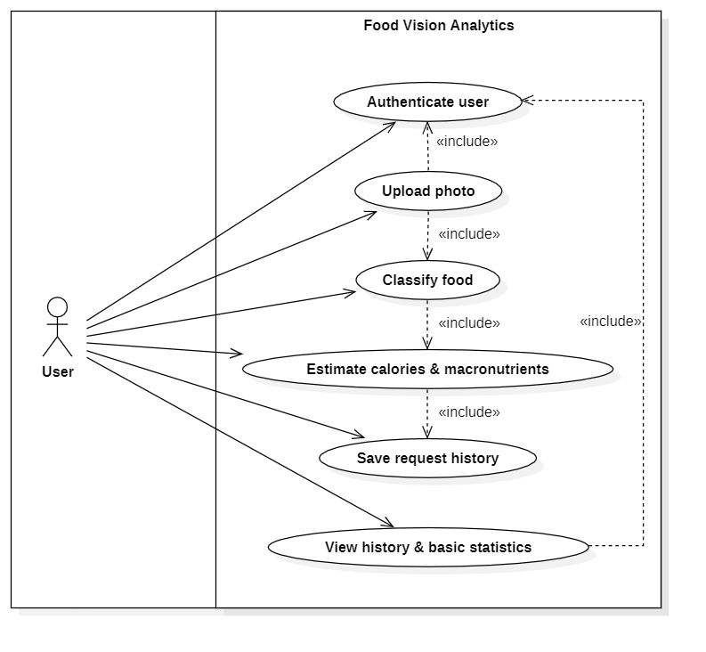
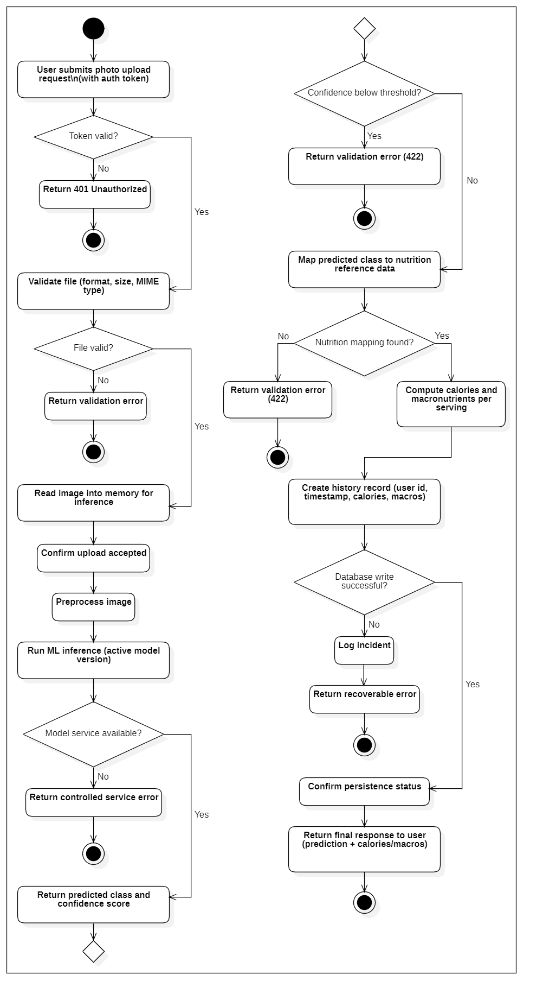
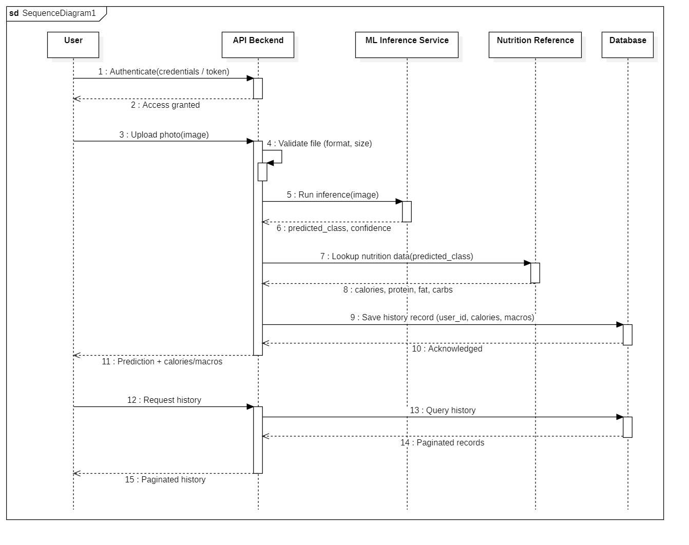

# System Design and Modeling (Stage 2)

## Food Vision Analytics - Design Document

> **Scope note:** This document covers Stage 2 (System Design and Modeling) of the project SDLC, following the requirements defined in Stage 1 (see `SRS_Stage1_Requirements.md`). It contains the Use Case, Activity, and Sequence diagrams for the delivered system.

## Contents

1. [Purpose and Relation to Stage 1](#1-purpose-and-relation-to-stage-1)
2. [Use Case Diagram](#2-use-case-diagram)
3. [Activity Diagram](#3-activity-diagram)
4. [Sequence Diagram](#4-sequence-diagram)

---

# 1. Purpose and Relation to Stage 1

Stage 1 defined **what** the system must do: actors, use cases, functional and non-functional requirements, and the MVP scope boundaries for the two-week iteration. Stage 2 translates that textual specification into three complementary visual models, each answering a different design question:

| Diagram | Question it answers |
| --- | --- |
| Use Case Diagram | Who interacts with the system, and what depends on what? |
| Activity Diagram | What is the step-by-step logic of the process, including decision points? |
| Sequence Diagram | How do the system's components talk to each other, and in what order? |

No new functionality is introduced at this stage. Every element on every diagram traces back to an actor, use case, functional requirement (FR), or alternative flow already defined in the Stage 1 SRS. Where the diagrams simplify or omit something from the original project proposal (e.g., admin-managed reference data, confidence-threshold configuration, time-series analytics), it is because that functionality is outside the scope of the current iteration, as defined by the SRS Constraints (Stage 1, Section 6).

---

# 2. Use Case Diagram

## Description

The diagram shows a single primary actor, **User**, interacting with the **Food Vision Analytics** system boundary, which contains six use cases carried over directly from SRS Section 3.3:

- Authenticate user
- Upload photo
- Classify food
- Estimate calories & macronutrients
- Save request history
- View history & basic statistics

## Relationships

The User actor is associated directly with only two use cases - **Upload photo** and **View history & basic statistics** - because these are the two actions the user actually initiates. Every other use case is pulled in as mandatory sub-behavior via `<<include>>` relationships:

- **Upload photo** includes **Authenticate user** - per FR-1, the system rejects unauthenticated upload requests.
- **View history & basic statistics** includes **Authenticate user** - per FR-5, history access is restricted to the record owner.
- **Upload photo** includes **Classify food**, which includes **Estimate calories & macronutrients**, which includes **Save request history** - this chain models the fact that, per the SRS main flows (Section 4, UC-2 through UC-5), these steps always execute together as one uninterrupted pipeline once a photo is accepted. None of them is a use case the user can invoke independently.

## Scope decisions reflected on the diagram

- The **Admin** actor, present in the SRS Actor Registry, is deliberately **not shown**. In the current MVP, Admin does not interact with the system through any use case - the nutrition reference dataset is maintained as a static seed file outside the running application (see SRS Section 6, Constraints). Including an actor with no use case connection would misrepresent the system and was avoided.
- No use case exists for confidence-threshold configuration or reference-data management - both are outside the scope of the current iteration and are excluded here for the same reason.

---

# 3. Activity Diagram

## Description

The Activity Diagram models the single, most business-critical process in the system: the end-to-end photo upload and analysis pipeline (SRS UC-1 through UC-5), including every alternative/error flow already described in SRS Section 4. It is read top to bottom as one continuous flow with decision diamonds at each point where the SRS specifies alternative behavior.

## Main flow and decision points

| Decision point | Source in SRS | Behavior if condition fails |
| --- | --- | --- |
| Token valid? | UC-1 alt. flow | Return 401 Unauthorized, process ends |
| File valid? | UC-2 alt. flow (invalid type / too large) | Return validation error, process ends |
| Model service available? | UC-3 alt. flow | Return controlled service error, process ends |
| Confidence below threshold? | UC-3 alt. flow | Return validation error (422), process ends; no history record is created |
| Nutrition mapping found? | UC-4 alt. flow | Return validation error (422), process ends; no history record is created |
| Database write successful? | UC-4/UC-5 alt. flow | Log incident, return recoverable error, process ends |

## Design notes

- Every alternative-flow branch terminates the flow immediately (`stop`) and returns an error response with no further processing - including the confidence and nutrition-mapping checks, which in the delivered implementation reject the request outright rather than attaching a soft warning to a saved record. All six decision points on this diagram behave uniformly in that respect.
- **View history & basic statistics (UC-6)** is intentionally not part of this diagram. It is a self-contained, read-only flow with no side effects (authenticate → query → paginate → return), so modeling it on the same diagram would add a disconnected branch without adding clarity. It is, however, fully modeled in the Sequence Diagram below.

---

# 4. Sequence Diagram

## Description

The Sequence Diagram shows the happy-path interaction between five participants - **User**, **API Backend**, **ML Inference Service**, **Nutrition Reference**, and **Database** - across the full request lifecycle. It is intentionally scoped to the main flow only; the alternative/error behavior already covered in the Activity Diagram and in SRS Section 4 is not duplicated here, to keep the diagram readable and focused on component interaction rather than branching logic.

The diagram is organized into three labeled sections that map directly onto the SRS use case groups:

### Authentication

`User → API Backend`: the user authenticates once at the start of the session (UC-1). This models the precondition established by the `<<include>>` relationships on the Use Case Diagram.

### Upload and analysis

`User → API Backend → ML Inference Service → Nutrition Reference → Database`: this section is the sequential realization of the Use Case Diagram's include chain (UC-2 → UC-3 → UC-4 → UC-5):

1. File validation happens locally in the API Backend.
2. The API Backend calls the ML Inference Service and receives the predicted class and confidence.
3. The API Backend queries the **Nutrition Reference** as a distinct participant, not folded into the Database - even though both may physically live in the same PostgreSQL instance in the current iteration, they are conceptually separate: the reference dataset is static and Admin-maintained (per SRS constraints), while the Database stores dynamic, per-user history.
4. The API Backend persists the result and returns the combined response to the user.

### History review

`User → API Backend → Database`: models UC-6 independently, since it has no dependency on the upload pipeline: authenticate, query the current user's records, paginate, return.

---
